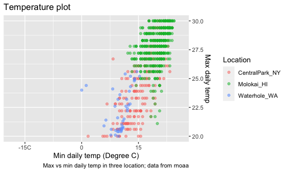
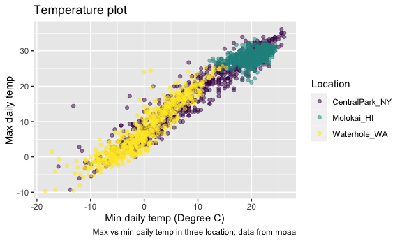

Viz Part II
================
2023-10-03

``` r
library(tidyverse)
```

    ## ── Attaching core tidyverse packages ──────────────────────── tidyverse 2.0.0 ──
    ## ✔ dplyr     1.1.3     ✔ readr     2.1.4
    ## ✔ forcats   1.0.0     ✔ stringr   1.5.0
    ## ✔ ggplot2   3.4.3     ✔ tibble    3.2.1
    ## ✔ lubridate 1.9.2     ✔ tidyr     1.3.0
    ## ✔ purrr     1.0.2     
    ## ── Conflicts ────────────────────────────────────────── tidyverse_conflicts() ──
    ## ✖ dplyr::filter() masks stats::filter()
    ## ✖ dplyr::lag()    masks stats::lag()
    ## ℹ Use the conflicted package (<http://conflicted.r-lib.org/>) to force all conflicts to become errors

``` r
library(patchwork)

knitr::opts_chunk$set(
  fig.width = 6,
  fig.asp = .6,
  out.width = "90%"
)
```

``` r
weather_df = 
  rnoaa::meteo_pull_monitors(
    c("USW00094728", "USW00022534", "USS0023B17S"),
    var = c("PRCP", "TMIN", "TMAX"), 
    date_min = "2022-01-01",
    date_max = "2023-12-31") |>
  mutate(
    name = recode(
      id, 
      USW00094728 = "CentralPark_NY", 
      USW00022534 = "Molokai_HI",
      USS0023B17S = "Waterhole_WA"),
    tmin = tmin / 10,
    tmax = tmax / 10) |>
  select(name, id, everything())
```

    ## using cached file: /Users/tianyiwang/Library/Caches/org.R-project.R/R/rnoaa/noaa_ghcnd/USW00094728.dly

    ## date created (size, mb): 2023-09-28 10:19:06.75893 (8.524)

    ## file min/max dates: 1869-01-01 / 2023-09-30

    ## using cached file: /Users/tianyiwang/Library/Caches/org.R-project.R/R/rnoaa/noaa_ghcnd/USW00022534.dly

    ## date created (size, mb): 2023-09-28 10:19:14.282268 (3.83)

    ## file min/max dates: 1949-10-01 / 2023-09-30

    ## using cached file: /Users/tianyiwang/Library/Caches/org.R-project.R/R/rnoaa/noaa_ghcnd/USS0023B17S.dly

    ## date created (size, mb): 2023-09-28 10:19:17.752484 (0.994)

    ## file min/max dates: 1999-09-01 / 2023-09-30

This results in a dataframe with 1914observations on six variables.

## same plot from last time

``` r
weather_df |>
  ggplot(aes(x = tmin, y = tmax, color = name)) +
  geom_point(alpha = .5) +
  labs(
    title = "Temperature plot",
    x = "Min daily temp (Degree C)",
    y = "Max daily temp",
    color = "Location",
    caption = "Max vs min daily temp in three location; data from rnoaa"
  )
```

    ## Warning: Removed 30 rows containing missing values (`geom_point()`).


``` r
weather_df |>
  ggplot(aes(x = tmin, y = tmax, color = name)) +
  geom_point(alpha = .5) +
  labs(
    title = "Temperature plot",
    x = "Min daily temp (Degree C)",
    y = "Max daily temp",
    color = "Location",
    caption = "Max vs min daily temp in three location; data from rnoaa"
  ) +
  scale_x_continuous(
    breaks = c(-15, 0, 15),
    labels = c("-15C", "0", "15")
  ) +
  scale_y_continuous(
    position = "right",
    limits = c(20, 30)
  )
```

    ## Warning: Removed 1106 rows containing missing values (`geom_point()`).



if I use filter, it will also update the data on the x axis

``` r
weather_df |>
  filter(tmax >= 20, tmax<= 30) |>
  ggplot(aes(x = tmin, y = tmax, color = name)) +
  geom_point(alpha = .5) +
  labs(
    title = "Temperature plot",
    x = "Min daily temp (Degree C)",
    y = "Max daily temp",
    color = "Location",
    caption = "Max vs min daily temp in three location; data from rnoaa"
  ) +
  scale_x_continuous(
    breaks = c(-15, 0, 15),
    labels = c("-15C", "0", "15")
  ) +
  scale_y_continuous(
    position = "right",
  )
```


what about colors …

``` r
weather_df |>
  ggplot(aes(x = tmin, y = tmax, color = name)) +
  geom_point(alpha = .5) +
  labs(
    title = "Temperature plot",
    x = "Min daily temp (Degree C)",
    y = "Max daily temp",
    color = "Location",
    caption = "Max vs min daily temp in three location; data from rnoaa"
  ) +
  viridis:: scale_color_viridis(discrete = TRUE)
```

    ## Warning: Removed 30 rows containing missing values (`geom_point()`).



## themes

`theme_minimal`, `theme_bw`, `theme_classic`

``` r
weather_df |>
  ggplot(aes(x = tmin, y = tmax, color = name)) +
  geom_point(alpha = .5) +
  labs(
    title = "Temperature plot",
    x = "Min daily temp (Degree C)",
    y = "Max daily temp",
    color = "Location",
    caption = "Max vs min daily temp in three location; data from rnoaa"
  ) +
  viridis:: scale_color_viridis(discrete = TRUE)+
  theme_minimal() + 
  theme(legend.position = "bottom")
```

    ## Warning: Removed 30 rows containing missing values (`geom_point()`).


## data argument …

``` r
weather_df |>
  ggplot(aes(x = date, y = tmax, color = name)) +
  geom_point(aes(color = name)) +
  geom_smooth()
```

    ## `geom_smooth()` using method = 'loess' and formula = 'y ~ x'

    ## Warning: Removed 30 rows containing non-finite values (`stat_smooth()`).

    ## Warning: Removed 30 rows containing missing values (`geom_point()`).


``` r
nyc_weather_df = 
  weather_df |>
  filter(name == "CentralPark_NY")

hawaii_weather_df = 
  weather_df |>
  filter(name == "Molokai_HI")

ggplot(nyc_weather_df, aes(x = date, y = tmax, color = name)) +
  geom_point()+
  geom_line(data = hawaii_weather_df)
```

    ## Warning: Removed 5 rows containing missing values (`geom_point()`).

    ## Warning: Removed 5 rows containing missing values (`geom_line()`).


## `patchwork`

``` r
weather_df |>
  ggplot(aes(x = date, y = tmax, color = name)) +
  geom_point() +
  facet_grid(. ~ name)
```

    ## Warning: Removed 30 rows containing missing values (`geom_point()`).


make to different ggplots and put them side by side

``` r
ggp_temp_scatter = 
  weather_df |>
  ggplot(aes(x = tmin, y = tmax, color = name))+
  geom_point(alpha = .5) +
  theme(legend.position = "bottom")

ggp_prcp_density = 
  weather_df |>
  filter(prcp> 25) |>
  ggplot(aes(x = prcp, fill = name)) +
  geom_density(alpha = .5) +
  theme(legend.position = "bottom")

ggp_tmax_date = 
  weather_df |>
  ggplot(aes(x = date, y = tmax, color = name)) +
  geom_point() +
  geom_smooth(se = FALSE) +
  theme(legend.position = "bottom")

(ggp_temp_scatter + ggp_prcp_density) / ggp_tmax_date
```

    ## Warning: Removed 30 rows containing missing values (`geom_point()`).

    ## `geom_smooth()` using method = 'loess' and formula = 'y ~ x'

    ## Warning: Removed 30 rows containing non-finite values (`stat_smooth()`).
    ## Removed 30 rows containing missing values (`geom_point()`).


## data manipulation

``` r
weather_df |>
  mutate(
    name = fct_relevel(name, c("Molokai_HI", "CentralPark_NY", "Waterhole_WA"))
  )|>
  ggplot(aes(x = name, y = tmax)) +
  geom_boxplot()
```

    ## Warning: Removed 30 rows containing non-finite values (`stat_boxplot()`).


``` r
weather_df |>
  mutate(
    name = fct_reorder(name, tmax)
  )|>
  ggplot(aes(x = name, y = tmax, color = name)) +
  geom_violin()
```

    ## Warning: There was 1 warning in `mutate()`.
    ## ℹ In argument: `name = fct_reorder(name, tmax)`.
    ## Caused by warning:
    ## ! `fct_reorder()` removing 30 missing values.
    ## ℹ Use `.na_rm = TRUE` to silence this message.
    ## ℹ Use `.na_rm = FALSE` to preserve NAs.

    ## Warning: Removed 30 rows containing non-finite values (`stat_ydensity()`).


character varialbe does not have order, factor variable does have order
ggplot convert character variable into factor in alphabetical order

## complicate FAS plot

``` r
litters_df = 
  read_csv("data/FAS_litters.csv") |>
  janitor::clean_names() |>
  separate(group, into = c("dose", "day_of_tx"), sep = 3)
```

    ## Rows: 49 Columns: 8
    ## ── Column specification ────────────────────────────────────────────────────────
    ## Delimiter: ","
    ## chr (2): Group, Litter Number
    ## dbl (6): GD0 weight, GD18 weight, GD of Birth, Pups born alive, Pups dead @ ...
    ## 
    ## ℹ Use `spec()` to retrieve the full column specification for this data.
    ## ℹ Specify the column types or set `show_col_types = FALSE` to quiet this message.

``` r
pups_df = 
  read_csv("data/FAS_pups.csv") |>
  janitor::clean_names()
```

    ## Rows: 313 Columns: 6
    ## ── Column specification ────────────────────────────────────────────────────────
    ## Delimiter: ","
    ## chr (1): Litter Number
    ## dbl (5): Sex, PD ears, PD eyes, PD pivot, PD walk
    ## 
    ## ℹ Use `spec()` to retrieve the full column specification for this data.
    ## ℹ Specify the column types or set `show_col_types = FALSE` to quiet this message.

``` r
fas_df = 
  left_join(pups_df, litters_df, by = "litter_number")

fas_df |>
  select(dose, day_of_tx, starts_with("pd")) |>
  pivot_longer(
    pd_ears:pd_walk,
    names_to = "outcome",
    values_to = "pn_day"
  )|>
  drop_na()|>
  mutate(outcome = fct_reorder(outcome, pn_day)) |>
  ggplot(aes(x = dose, y = pn_day)) +
  geom_violin() +
  facet_grid(day_of_tx ~ outcome)
```


